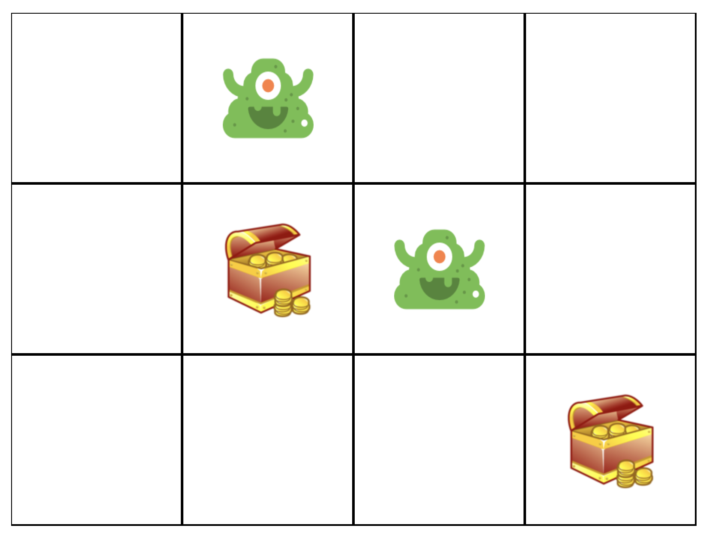
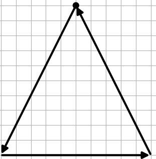
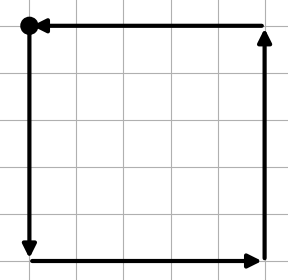
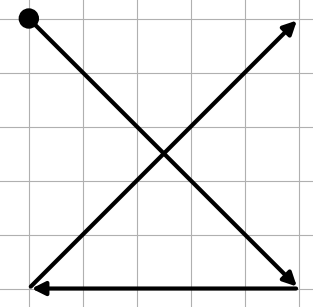

Welcome
===
Thank you for participating to this user test. We are evaluating the strong and weak points of different
library supports for implementing  stroke gestures interfaces and, considering your experience as a developer, 
your opinion is valuable for us. In this test, you are going to implement a small interactive web application that 
responds to a set of stroke gestures for changing its state. 

Intro
===
The application you are going to develop is the simple 3x4 grid map in the figure below.
We provide you with different libraries for managing 
the application graphics, for tracking the user's input, displaying the stroke guidance and recognizing gestures.
Your role is to combine them appropriately for obtaining the target application.

The user places contents in the different cells drawing the following strokes through the pointer device (mouse or touch):
*  **Triangle** the cell content changes into a green monster
*  **Square** the cell content changes into a treasure box
*  **Delete** the cell returns empty

In order to get information on how to handle the application graphics and registering the user's input you can 
revise the {@tutorial Managing the grid map} and the {@tutorial Registering strokes} tutorials.

In order to provide guidance to the user, you are required to use two types of feedback, whose implementation is
available in the library:
*  **Line Feedback** that simply draws the user's stroke (see {@tutorial Using the line feedback}).
*  **Octopocus** that provides information on how to complete the stroke (see {@tutorial Using the Octopocus feedback})

We are interested in evaluating the impact of the gesture recognition library on building the user interface. We
consider three approaches:
* **Heuristic recognition** in which the developer writes code procedures for recognizing the gesture according to 
simple geometric features ({@tutorial Recognizing gestures with Finite State Machines})
* **Machine Learning** in which the developer trains a classifier with a set of examples 
({@tutorial Recognizing gestures with Machine Learning})
* **Deictic** an hybrid approach that builds a classifier from the geometric gesture modelling. 
({@tutorial Recognizing gestures with Deictic})

In the test, we will ask you to exploit all the recognition approaches for building the grid application, once 
configured with the line and once configured with the Octopocus feedback. Your are going to create 3x2=6 versions 
of this application. Don't worry, the code libraries will help you in that :) 

Docs and Tutorials
===

In order to recreate a context similar to real-world application development, we provide you with two libraries,
one for managing the user's input and one for managing the application graphics. The graphics library provides UI 
components for managing the UI of the case study.
The input library provides a simplified implementation of the three approaches for recognizing the same gestures, 
which we are going to evaluate in this test.

As usually happens in modern software development, your role is to compose the capabilities of these libraries for 
creating a new application. We provide you with both a detailed API documentation, accessible through the side-panel
of this page, and with a set of tutorials on how to get started with each component. You are requested to give a brief
look at them in order to understand the role of each component in the target application. You can go back and read
the available documentation at any moment during the development. 

The tutorials are the following:
1. {@tutorial Managing the grid map}
2. {@tutorial Registering strokes}
3. {@tutorial Using the line feedback}
4. {@tutorial Using the Octopocus feedback}
5. {@tutorial Recognizing gestures with Finite State Machines}
6. {@tutorial Recognizing gestures with Machine Learning}
7. {@tutorial Recognizing gestures with Deictic} 

The tasks
===

In this test there are two tasks that you're going to perform trice, once for each gesture recognition algorithm.
We assign the order of algorithms randomly, so the moderator will provide your personal order. 

In all tasks, the gesture set we consider is the following. The gestures must be performed with the sequence depicted
below.   
The circle is the starting point, the arrows indicate the direction of the stroke.
Please **use the names we provided for the gestures**, this will help us in analysing the data.
*  
  **triangle** (adds a monster)
*  
  **square** (adds a treasure box)
*  
  **delete** (deletes the cell content)

Before starting, please fill the <a href="http://104.196.211.17/limesurvey/index.php/952736?newtest=Y&lang=it" >
demographic questionnaire</a>.

Pre-Task
--
Ask the moderator to check if the local development server is up. If not the following are the commands needed:
1. From the deictic project root directory execute `cd user-test/gesturemap/`
2. Execute  `python3 manage.py runserver` 

Task 1
---
Please take note of the time you start. 
Please implement the grid map application using the {@link Input.LineFeedback} object. According to the recognition
algorithm you are using, you will put the code in the following file and you will access the application through a
different url:

* **Heuristic** source file: `app-heuristic-line.js` app link: 
<a href="http://localhost:8000/basic/map/heuristic/line" >http://localhost:8000/basic/map/heuristic/line</a>.
* **Machine Learning** source file: `app-ml-line.js` app link: 
<a href="http://localhost:8000/basic/map/ml/line" >http://localhost:8000/basic/map/ml/line</a>.
* **Deictic** source file: `app-deictic-line.js` app link: 
<a href="http://localhost:8000/basic/map/deictic/line" >http://localhost:8000/basic/map/deictic/line</a>.

When the application works correctly, take note of the time you finished. 
After that, please fill the  <a href="http://104.196.211.17/limesurvey/index.php/952736?lang=it" >
post task questionnaire</a>.

Task 2
---
Please take note of the time you start. 
Please implement the grid map application using the {@link Input.Octopocus} object. According to the recognition
algorithm you are using, you will put the code in the following file and you will access the application through a
different url:

* **Heuristic** source file: `app-heuristic-octo.js` app link: 
<a href="http://localhost:8000/basic/map/heuristic/octo" >http://localhost:8000/basic/map/heuristic/octo</a>.
* **Machine Learning** source file: `app-ml-octo.js` app link: 
<a href="http://localhost:8000/basic/map/ml/octo" >http://localhost:8000/basic/map/ml/octo</a>.
* **Deictic** source file: `app-deictic-octo.js` app link: 
<a href="http://localhost:8000/basic/map/deictic/octo" >http://localhost:8000/basic/map/deictic/octo</a>.

When the application works correctly, take note of the time you finished. 
After that, please fill the  <a href="http://104.196.211.17/limesurvey/index.php/873383?lang=it" >
post task questionnaire</a>.

Post test
---
**You should fill the following questionnaire only when you have completed the two tasks with all recognition 
algorithms (3 times).**

Please fill the <a href="http://104.196.211.17/limesurvey/index.php/873383?lang=it" >post test questionnaire</a>.